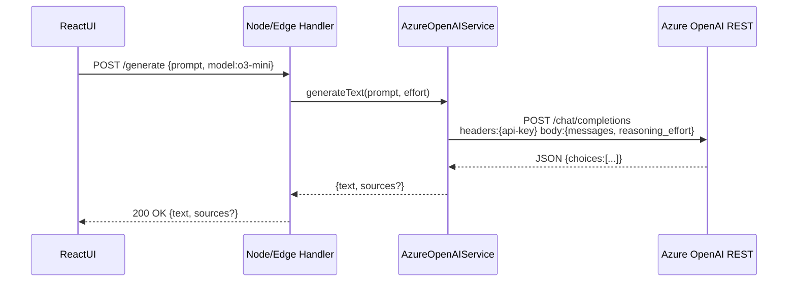

# Azure OpenAI “o3” Model – Implementation Guide

> Goal: Make the **o3** family of models a first-class option within the Reveries code-base (client + server) while preserving existing Gemini & Grok support, protecting credentials, and meeting operational SLAs.

---

## 1. Source-Code Touch-Points

| Layer | File | Change |
|-------|------|--------|
| Types / constants | [`types.ts`](../types.ts) | `export const AZURE_O3_MODEL = "o3-mini"` (already present) |
| Model selection | [`constants.ts`](../constants.ts) | `DEFAULT_MODEL` chooses o3 if `AZURE_OPENAI_AVAILABLE` |
| Service instantiation | [`services/researchAgentService.ts`](../services/researchAgentService.ts) | Branch to `generateTextWithAzureOpenAI` when `selectedModel === AZURE_O3_MODEL` |
| Azure service | [`services/azureOpenAIService.ts`](../services/azureOpenAIService.ts) | Handles **o3** deployment, reasoning_effort, retry, streaming |
| Browser stub | [`services/azureOpenAIStub.ts`](../services/azureOpenAIStub.ts) | Always `isAvailable() === false` to avoid client-side usage |
| UI model filter | [`components/Controls.tsx`](../components/Controls.tsx) | Hides o3 when `AZURE_OPENAI_AVAILABLE` is `false` |

---

## 2. Environment Variables

| Variable | Example | Notes |
|----------|---------|-------|
| `AZURE_OPENAI_ENDPOINT` | `https://my-openai-resource.openai.azure.com` | Required |
| `AZURE_OPENAI_API_KEY` | `******` | Key‐vault/secret manager |
| `AZURE_OPENAI_DEPLOYMENT` | `o3-mini` | Name of deployment in Azure portal |
| `AZURE_OPENAI_API_VERSION` | `2024-10-01-preview` | Latest preview or GA supported by SDK |

---

## 3. Reasoning-Effort Mapping

```ts
private mapEffortToReasoning(effort: EffortType): "low" | "medium" | "high" {
  switch (effort) {
    case EffortType.LOW:    return "low";
    case EffortType.MEDIUM: return "medium";
    case EffortType.HIGH:   return "high";
  }
}
```

* Sent as `reasoning_effort` only for deployments whose name includes **o3**.
* Keeps backward compatibility with non-o3 deployments.

---

## 4. Server-Side Request Pipeline



* **Retry**: up to 3 attempts (`withRetry`).
* **Streaming**: `streamResponse()` uses `reader.read()` to push deltas to the UI.
* **Tool-Calls**: `generateResponseWithTools()` returns `toolCalls` payload when assistant responded with tool invocations.

### Background Tasks
As of 2025-04-01-preview, Azure may return **202 Accepted** with an
`operation-location` header for long-running jobs.  
Our client now polls this URL (respecting `retry-after`) and penalizes the
global `RateLimiter` to avoid flooding the service.

---

## 5. Client ↔ Server Contract

```jsonc
// Request
POST /api/generate
{
  "prompt": "Explain quantum tunneling",
  "model": "o3-mini",
  "effort": "Medium",
  "stream": false        // optional
}

// Response (non-stream)
200 OK
{
  "text": "...answer...",
  "sources": [ { "url": "...", "title": "..." } ]
}

// Streaming protocol
data: {"delta":"first tokens"}
data: {"delta":"next tokens"}
data: [DONE]
```

* Errors: `4xx` (client), `5xx` (server) plus JSON body `{code,message,retryable}`.

---

## 6. UI Availability Gating

```ts
const availableModels = Object.entries(MODEL_INFO).filter(([key]) => {
  if (key === AZURE_O3_MODEL && !AZURE_OPENAI_AVAILABLE) return false;
  ...
});
```

* `AZURE_OPENAI_AVAILABLE` is resolved **server-side** and bundled as Vite‐time constant for SSR/Edge builds, ensuring keys never leak to browsers.

---

## 7. Security & Quota

1. **Credential storage**: Azure Key Vault, Secret Manager, or Vercel/Netlify env-vars (never Git).
2. **Network egress**: allowlist Azure endpoint.
3. **Quota**: monitor `X-RateLimit-Remaining-Tokens` header, surface drop to 10 % in logs.
4. **Budgeting**: default `max_tokens = 2000`; clamp to 4096 minus prompt length.
5. **P0 fallback**: on `429` or `5xx`, auto-retry; after 3 fails fall back to Gemini flash with warning.

---

## 8. Ops Checklist

| Area | Item |
|------|------|
| Secrets | Rotate keys monthly, CI pipeline fetches from secure store |
| Alerts | 4xx ≥ 50/h or 5xx ≥ 10/h triggers PagerDuty |
| Logs | Persist requestId, model, latency, cost_estimate |
| Dashboards | Token usage vs quota, error rate, latency p95 |
| Deployment | Blue/Green; verify env-vars present before healthcheck passes |

---

## 9. Testing Strategy

* **Unit**: `mapEffortToReasoning`, retry backoff, error mapping.
* **Integration**: stub fetch to Azure REST, assert payload contains `reasoning_effort`.
* **Smoke**: CI workflow hits `/api/generate` with “ping”, expects non-empty text in ‹5 s.
* **Load**: k6 script ~20 RPS, ensure <2% error.

---

## 10. Roll-out Steps (Swimlane)

```mermaid
flowchart LR
  subgraph Dev
    A[Add env vars] --> B[Implement AzureOpenAIService (done)]
    B --> C[Unit tests pass]
  end
  subgraph CI/CD
    C --> D[Deploy to Staging]
    D --> E[Smoke tests]
    E --> F{Errors?}
    F -- yes --> G[Rollback]
    F -- no --> H[Promote to Prod]
  end
  subgraph Prod
    H --> I[Monitor dashboards]
    I -->|Degrade| G
  end
```

---

### Appendix A – Reference Links
* Azure REST docs: <https://learn.microsoft.com/azure/ai-services/openai/reference>
* Token calculator: <https://platform.openai.com/tokenizer>
