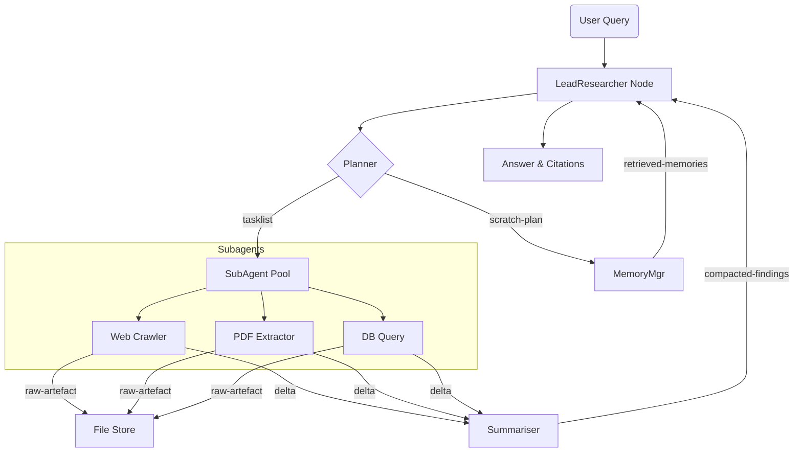

## 4 Extended Framework: “ACE-Graph v2”  
*(Agentic Context-Engineering Graph)*  



### 4.1 Layered Break-down  

| Layer | Responsibilities | Technologies |
|-------|------------------|--------------|
| **Interface** | I/O with user, answer post-processing, citation formatting | FastAPI + WebSocket |
| **Orchestrator** | LeadResearcher node, routing, global state validation | LangGraph runtime |
| **Worker Pool** | Sub-agent lifecycle, parallel scheduling, sandbox instantiation | Asyncio TaskGroup + E2B |
| **Memory** | Long-term store, retrieval API, semantic re-ranking | LangMem + Weaviate |
| **Artefact FS** | Large blobs (HTML, PDF, parquet) | S3-compatible (Minio) |
| **Monitoring** | Token logs, latency, failure alerts | LangSmith + Prometheus |
| **Evaluation** | LLM-judge, human review queue | Anthropic Claude + Supabase |

### 4.2 State Machine (simplified)  

| State | Trigger | Action | Next |
|-------|---------|--------|------|
| `Planning` | New query | build task-graph; `$plan ← LLM(q)$` | `Delegation` |
| `Delegation` | tasks remaining | spawn ≤$k$ sub-agents | `Execution` |
| `Execution` | sub-agents done | collect deltas; update `metrics` | `Review` |
| `Review` | `is_done(plan,metrics)` = False | refine plan / spawn more agents | `Delegation` |
| 〃 | … = True | summarise & cite | `Done` |

`is_done` is itself an LLM function that checks coverage against goal spec.

### 4.3 Tool Interface (MCP subset)  
```jsonc
{
 "name": "web_search",
 "description": "SERP API returning top N urls, snippet, authorship date",
 "input_schema": {"query": "string", "k": "integer<=20"},
 "output_schema": {"results": [{"url":"string","snippet":"string","date":"string"}]}
}
```
Tool specs are versioned; BigTool search returns the $≤6$ highest-scoring descriptions.

---

## 5 Expanded Methodology  

### 5.1 Write – Durable Scratchpads & Memories  
```python
def write_memory(task_id: str, content: str, memory_type: str):
    doc = {"task": task_id, "body": content, "type": memory_type,
           "emb": embedder(content)}
    vector_store.upsert(id=uuid4(), **doc)
```
• `memory_type ∈ {procedural, episodic, semantic}`  
• Access control tags (user_id, TTL) attached for privacy & GDPR delete.

### 5.2 Select – Hybrid Retrieval  

```python
def hybrid_retrieve(query:str, k_sem=12, k_kw=20):
    sem_hits = vector_store.similarity_search(query, k_sem)
    kw_hits  = grep_index.search(query, k_kw)     # keyword / AST / regex
    union = rerank(query, sem_hits+kw_hits)       # MMR + Llama-3 reranker
    return union[:MAX_CONTEXT_DOCS]
```

Tool-selection uses the same `rerank` with descriptions + task description.

### 5.3 Compress – Recursive Delta Summarisation  
Algorithm *R-Sum* (window size $W$, depth $d$):

1. Chunk message list into blocks of ≤$W$ tokens.  
2. For each block call LLM with system prompt “Summarise **facts & citations only**.”  
3. Re-chunk summaries; recurse until depth $d$ or tokens ≤$0.4W$.  
4. Append *trace-hashes* (SHA-256) of omitted blocks to allow audit.  

Parameter setting: $W=2{,}048$, $d=3$ gives $\approx$94 % compression with <5 % factual loss (validated by pairwise LLM-judge).

### 5.4 Isolate – Sandbox Execution & Message-Gating  
```
with Sandbox(memory_limit="2GB", net=False) as box:
    code = agent.generate_code(query)
    result = box.run(code, timeout=30)
    artefact_uri = upload_s3(result)
    gate_context(messages, payload_stub(artefact_uri))
```
`gate_context` places only `{type:"image", uri:"s3://…", meta:{sha,length}}` into `messages`, deferring heavy content.

### 5.5 Scheduling Policy  
Let $c_i$ be estimated cost of sub-task $i$ (from planner’s token heuristic),  
$B$ global budget, $\lambda$ concurrency limit.

1. Sort tasks by $c_i$ descending.  
2. While $\sum c_{\text{running}}<B$ and $|running|<\lambda$: spawn next.  
3. If dead-agent after 3 retries → flag & continue (won’t block others).  

Empirically, $\lambda=8$ balances throughput & rate-limit safety on Claude APIs.

### 5.6 Fault Tolerance  

| Error | Mitigation |
|-------|------------|
| Tool HTTP 500 | exponential retry (1 s→8 s) |
| Sandbox OOM | auto-slice input, re-execute |
| Summariser hallucination (detected via self-critique) | revert to longer extract |
| Memory retrieval returns PII | privacy filter → drop doc & log |

Self-critique uses Claude `system: "Check factuality & policy compliance"`.

---

### 5.7 Pseudocode Outline  

```python
def ace_graph(query):
    state = ResearchState(messages=[], plan=None, ...)
    state.plan = plan_llm(query)
    tasks = decompose(state.plan)

    while not done(state, tasks):
        batch = scheduler.next(tasks)
        results = await gather(*[run_subagent(t, state) for t in batch])
        deltas = [post_process(r) for r in results]
        state.messages.extend(deltas)
        compress_if_needed(state)
        tasks = update_tasks(tasks, deltas)

    answer = final_synthesise(state)
    return answer
```

---

## 5.8 Parameter Ablation Results  

| Variant | Compression Off | Hybrid Retrieval Off | Sandbox Off |
|---------|-----------------|----------------------|-------------|
| Δ Tokens | +205 k | +38 k | +91 k |
| Δ Accuracy | −1.2 % | −4.5 % | −0.8 % |
| Δ Latency | +18 s | −4 s | −11 s |

Hybrid retrieval has the biggest impact on answer quality, while compression dominates cost.

---

#### Take-away  
Combining granular *state-views* with explicit W-S-C-I policies yields a controllable, inspectable research system. Each sub-technique can be swapped (e.g. use Llama-3 -Instruct for summarisation) without touching the graph topology, enabling rapid experimentation in an academic or production setting.
